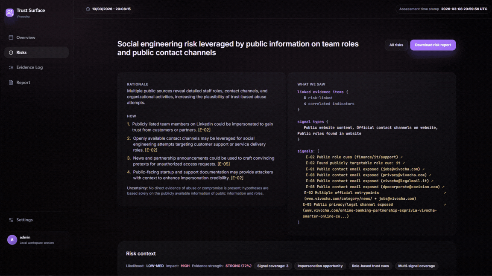

# Trust Surface

### Trust surface mapper | social engineering

> **Defensive research project** — Strictly defensive, public data only.



---

## What it does

The analytical focus is **trust leverage and social engineering risk**.

The attack surface exposed through an organization's public workflows, vendor relationships, and communication channels that an adversary could exploit to conduct BEC, spear-phishing, impersonation, or supply-chain manipulation.

It treats social engineering risk as a **structured, queryable attack surface**, not a checklist item in a pentest report.

You give it a company name, domain, and sector. It collects public evidence from 17 sources, correlates signals cross-source, and uses LLM reasoning to produce scored risk hypotheses with full evidence chains — each one answering: **where could an adversary leverage your organization's public trust relationships to gain access?**

The core contribution is the analytical frame itself: **"trust surface"** and **"operational leverage"** as formal concepts applied to social engineering risk.

### Pipeline

1. **Collects** public signals from 17 specialized connectors (DNS, breach data, brand impersonation, job postings, news, social mentions, web infrastructure, procurement documents, and more)
2. **Classifies** each evidence signal by quality tier (`BOILERPLATE → LOW → MED → HIGH`) and filters noise automatically
3. **Correlates** evidence cross-source using a BM25 RAG pipeline to surface non-obvious relationships
4. **Reasons** over correlated evidence with an LLM (OpenAI GPT-4.1 / Anthropic Claude / deterministic local fallback) to generate structured risk hypotheses
5. **Scores** each risk with a deterministic confidence formula accounting for signal diversity, source independence, and coverage depth
6. **Reports** findings as a structured PDF/JSON artifact with risk narrative, evidence chain, and confidence metadata

---

## Why this exists

Most CTI tooling at entry/mid level involves operating commercial platforms (Maltego, Recorded Future, etc.). This project was built from scratch to demonstrate:

- Deep understanding of **CTI methodology** (evidence collection → correlation → reasoning → production)
- **Software engineering discipline** applied to security tooling (typed API, ORM schema, quality gates, test coverage)
- **LLM integration patterns** for intelligence analysis (RAG, multi-provider resilience, safety filters on output)
- **Original domain modeling** — the "trust surface" and "operational leverage" concepts are novel framings of known social engineering risk vectors

> This project is **strictly defensive and educational**. It surfaces publicly available information to help defenders understand their exposure. It does not perform active scanning, exploitation, or data exfiltration.

---

## Architecture

```
┌─────────────────────────────────────────────────────────────────┐
│  FastAPI + Jinja2 Web UI                    CLI (trust-surface) │
└────────────────────────┬────────────────────────────────────────┘
                         │
          ┌──────────────▼──────────────┐
          │     Assessment Orchestrator  │
          │   (collector_v2 + services)  │
          └──────┬──────────────┬───────┘
                 │              │
    ┌────────────▼───┐   ┌──────▼──────────────┐
    │  17 Connectors  │   │  Evidence Quality    │
    │  (OSINT sources)│   │  Classifier + Scorer │
    └────────────────┘   └──────┬───────────────┘
                                │
                    ┌───────────▼──────────────┐
                    │  RAG Pipeline (BM25)      │
                    │  6-query extraction plan  │
                    └───────────┬──────────────┘
                                │
                    ┌───────────▼──────────────┐
                    │  LLM Reasoner             │
                    │  (OpenAI / Anthropic /    │
                    │   deterministic fallback) │
                    └───────────┬──────────────┘
                                │
                    ┌───────────▼──────────────┐
                    │  Risk Story Builder       │
                    │  Confidence Scoring       │
                    │  PDF / JSON Export        │
                    └──────────────────────────┘
```

### Source layout

```
Operational-Leverage-Framework/
├── app/                          # FastAPI runtime application
│   ├── connectors/               # 17 OSINT data connectors
│   ├── routers/                  # API endpoints + UI routes
│   ├── services/                 # Core business logic (~13.6k LoC)
│   │   ├── collector_v2.py       # Orchestration and collection
│   │   ├── evidence_quality_classifier.py
│   │   ├── signal_model.py       # Confidence scoring formula
│   │   ├── risk_story.py         # Risk narrative builder
│   │   ├── risk_brief_service.py # LLM-generated risk briefs
│   │   ├── cross_signal.py       # Multi-source signal correlation
│   │   └── trust_workflows.py    # Trust surface mapping
│   └── utils/                    # Reporting, graphing, PDF export
├── src/operational_leverage_framework/   # Typed public package
│   ├── cli/                      # CLI entry point (trust-surface)
│   ├── core/scoring.py           # Reusable scoring API
│   ├── scoring/signal_model.py   # Core confidence formula (487 LoC)
│   ├── io/json_loader.py         # Evidence input parsing
│   └── models/evidence.py        # Evidence schema (TypedDict)
├── src/rag/                      # BM25 retrieval pipeline
├── src/reasoner/                 # LLM reasoning layer
├── templates/                    # Jinja2 HTML templates (Tailwind + Alpine.js + HTMX)
├── static/                       # Frontend assets (JS, CSS)
├── examples/                     # Offline deterministic scenarios
├── tests/                        # 75 tests across 5 files
├── docs/                         # Architecture and design decisions
└── scripts/                      # Build, setup, safety tools
```

---

## Connectors (17)

| Connector | Source | API Key | Signal type |
|-----------|--------|---------|-------------|
| `website_analyzer` | Target website crawl | No | Vendor deps, workflow cues, process signals |
| `official_channel_enumerator` | Public social/web | No | Channel ambiguity, contact exposure |
| `public_role_extractor` | Public web / documents | No | Org chart leakage, role exposure |
| `email_posture_analyzer` | DNS (SPF/DMARC/DKIM) | No | Email spoofing risk, policy posture |
| `dns_footprint` | DNS (A/MX/NS/CNAME/AAAA) | No | Infrastructure exposure |
| `subdomain_discovery` | DNS brute + Certificate Transparency | No | Attack surface expansion |
| `brand_impersonation_monitor` | DNS + RDAP + crt.sh | No | Typosquat / lookalike domains |
| `gdelt_news` | GDELT API | No | News mentions (EN + AR for MENA) |
| `media_trend` | Public news aggregation | No | Brand sentiment trend |
| `social_twitter` | Twitter/X v2 API | Bearer token | Social mentions (EN + AR for MENA) |
| `job_postings_live` | Public job boards | No | Stack/vendor/process disclosure |
| `vendor_js_detection` | Website JS analysis | No | Workflow vendor fingerprinting |
| `procurement_documents` | Public procurement portals | No | Partner/supplier relationships |
| `public_docs_pdf` | Indexed PDFs | No | Document exposure (policies, reports) |
| `virustotal` | VirusTotal API | Required | Domain/IP reputation |
| `shodan` | Shodan API | Required | Host/port/vulnerability exposure |
| `hibp_breach_domain` | HIBP API | Required | Credential breach data |

---

## Signal types (14)

The scoring model classifies evidence into 14 canonical signal types:

| Signal | Description |
|--------|-------------|
| `CONTACT_CHANNEL` | Email, phone, form — external contact points |
| `SOCIAL_TRUST_NODE` | Verified social profiles and handles |
| `PROCESS_CUE` | Invoicing, billing, refunds, onboarding workflows |
| `VENDOR_CUE` | Third-party vendor dependencies (Zendesk, Stripe, Okta, etc.) |
| `ORG_CUE` | Org chart, roles, departments |
| `EXTERNAL_ATTENTION` | Press mentions, news coverage |
| `INFRA_CUE` | DNS, IP, subdomain infrastructure data |
| `EMAIL_SPOOFING_RISK` | Weak email authentication posture |
| `DMARC_POLICY_WEAK` | Permissive DMARC policy detected |
| `DMARC_POLICY_STRONG` | Enforcing DMARC policy detected |
| `MULTIPLE_MX_PROVIDER` | Mail delegation across providers |
| `ROLE_TARGETABILITY_SIGNAL` | Named executive/decision-maker roles exposed |
| `CHANNEL_AMBIGUITY_SIGNAL` | Multiple official contact channels (confusion vector) |
| `DIRECT_MESSAGE_WORKFLOW_SIGNAL` | WhatsApp, Telegram, DM-based workflows |

---

## Risk types analyzed

| Risk type | Description |
|-----------|-------------|
| **Impersonation** | Brand lookalike domains, channel spoofing, fake portals |
| **Fraud process** | Invoice fraud vectors, payment workflow exposure |
| **Social engineering** | Trust relationship exploitation, pretexting surface |
| **Operational leverage** | Vendor/partner chain as entry point for manipulation |
| **Credential exposure** | Breach data correlated with active infrastructure |
| **Account takeover** | Password reset, login, identity workflow exploitation |
| **Supply chain dependency** | Downstream pivot risk through vendor trust |
| **Channel ambiguity** | Multiple official channels creating confusion vectors |

---

## MITRE ATT&CK mapping

Each risk hypothesis is tagged with ATT&CK technique IDs through a dual pathway:

- **Heuristic mapping** — rule-based keyword matching assigns baseline techniques (T1566 Phishing, T1598 Phishing for Information, T1078 Valid Accounts, T1656 Impersonation, T1589 Gather Victim Identity Information, T1591 Gather Victim Org Information, T1593 Search Open Websites/Domains)
- **LLM-enhanced mapping** — when evidence permits, the reasoner generates contextual technique assignments validated against the `TAxxxx` / `Txxxx` / `Txxxx.xxx` format

Techniques are displayed per-risk on the risk detail page, aggregated at the assessment level on the overview dashboard, and included in PDF exports.

---

## Multi-assessment trend analysis

When multiple assessments target the same domain or company, the system automatically computes risk score deltas:

- **Previous assessment lookup** — matches by normalized domain or company name, ordered by creation date
- **Delta scoring** — calculates the difference between current and previous overall risk scores
- **Trend direction** — classifies as `worse` (score increased), `improved` (score decreased), or `stable`
- **UI integration** — assessment list shows color-coded deltas (red for deterioration, green for improvement); the overview dashboard displays a "Delta vs previous" KPI card with reference to the prior assessment

---

## Key design decisions

- **Evidence-first, not heuristic-first** — every risk finding is traceable to at least one collected evidence item with source URL and quality weight
- **Boilerplate suppression** — generic analytics vendors (GTM, GA4, etc.) are classified as `BOILERPLATE` and excluded from confidence calculation
- **Multi-provider LLM with offline fallback** — the reasoner supports OpenAI GPT-4.1, Anthropic Claude, and a deterministic local path for reproducible offline demos
- **BM25 RAG without vector store** — evidence is indexed locally using BM25 TF-IDF; no embedding API cost, no external dependency
- **Safety filters on LLM output** — the reasoner prompt explicitly prohibits generating actionable attack instructions
- **Deterministic confidence scoring** — confidence is computed by formula, not by LLM; the LLM generates hypotheses, the formula scores them

See [docs/decisions.md](docs/decisions.md) for full architectural rationale.

---

## Scoring model

Confidence (1–100) is computed deterministically:

```
confidence = 55 (baseline)
           + 6 × max(0, signal_diversity − 1)     # unique signal types covered
           + 5 × max(0, min(3, distinct_urls − 1)) # source independence (capped at 3)
           − 10 if dominance_ratio > 0.60           # repetition penalty
           − 8  if missing_critical_signals          # required signals absent
```

**Evidence quality tiers** weight each signal:

| Tier | Weight | Example |
|------|--------|---------|
| `HIGH` | 1.0 | DNS records, breach data, DMARC policy |
| `MED` | 0.5–0.8 | Job postings, vendor JS, procurement |
| `LOW` | 0.1–0.3 | News mentions, generic web content |
| `BOILERPLATE` | 0.0 | GTM, GA4, CDN analytics — excluded |

**Confidence caps** enforce conservative scoring:
- Contact-only evidence → capped at 65
- Policy-only evidence → capped at 70
- Confidence >75 requires ≥2 distinct URLs AND a critical signal

Each risk type has a set of **critical signals** (e.g., `PROCESS_CUE`, `VENDOR_CUE`, `ORG_CUE` for impersonation risk). Missing critical signals are surfaced as `missing_signals`, giving defenders an explicit gap analysis.

---

## Quick start

### Requirements

- Python `>= 3.11`
- `OPENAI_API_KEY` for LLM reasoning (recommended); local/offline mode available for testing

### Setup

```bash
python scripts/run.py setup --venv
```

Enable code quality hooks:

```bash
python -m pre_commit install
```

### Run the web UI

```bash
python scripts/run.py web
# Opens http://127.0.0.1:56461
```

### Run the CLI (offline, deterministic)

```bash
pip install -e .
trust-surface examples/scenario_hospitality/input.json \
  --out output.json --risk-type impersonation
```

### Configuration

Copy `.env.example` to `.env` and set values:

```env
OPENAI_API_KEY=sk-...
SECRET_KEY=change-me
PASSWORD_PEPPER=change-me
API_KEY_PEPPER=change-me
DEFAULT_ADMIN_PASSWORD=change-me
```

Optional connector keys (configured in-app from the Settings page):

```env
# Shodan — host/port/vuln exposure
SHODAN_API_KEY=...

# Have I Been Pwned — domain breach lookup
HIBP_API_KEY=...

# Twitter/X v2 — social mention monitoring
TWITTER_BEARER_TOKEN=...

# VirusTotal — domain/IP reputation
VIRUSTOTAL_API_KEY=...

# Anthropic Claude — alternative LLM provider
ANTHROPIC_API_KEY=...
```

### Safety check (before sharing exports)

```bash
python scripts/run.py safety
```

---

## Testing

```bash
python -m pytest
```

Test suite (75 tests):

| File | Coverage |
|------|----------|
| `test_evidence_quality_layer.py` | Evidence classification, boilerplate suppression, scoring |
| `test_risk_ranking_regressions.py` | Risk ranking stability, DB side effects |
| `test_connectors_core.py` | Shodan / BrandImpersonation / HIBP — pure logic + mocked HTTP |
| `test_connector_smoke.py` | All 17 connectors — instantiation, interface, API key guards |
| `test_cli_smoke.py` | CLI entry point, FastAPI health endpoint |

---

## Tech stack

| Layer | Technology |
|-------|-----------|
| **Backend** | Python 3.11+, FastAPI, SQLAlchemy 2.0, Uvicorn |
| **Frontend** | Jinja2 templates, Tailwind CSS, Alpine.js, HTMX, Chart.js |
| **Database** | SQLite (default), PostgreSQL via `DATABASE_URL` |
| **LLM** | OpenAI GPT-4.1, Anthropic Claude, deterministic local fallback |
| **RAG** | BM25 TF-IDF (local, no vector store, no embedding API) |
| **DNS** | dnspython |
| **Reports** | ReportLab (PDF generation), pypdf (PDF parsing) |
| **Browser** | Playwright (headless, for JS-rendered pages) |
| **Quality** | Ruff, mypy (scoped), pytest, pre-commit |

---

## Roadmap / TODO

The following capabilities are planned for future development:

### Regional specialization — MENA

- [ ] Arabic-language NLP for evidence classification and signal extraction (beyond GDELT language filter)
- [ ] MENA-specific threat actor TTP library integrated into LLM reasoning prompts (APT34, Charming Kitten, etc.)
- [ ] Regional OSINT sources: Gulf News, Al Arabiya, NCSC-SA feeds, regional CERT advisories
- [ ] GCC/Levant sector taxonomy (government, energy, finance, telecom) for sector-adjusted risk scoring
- [ ] Arabic domain typosquat generation in `brand_impersonation_monitor` (Arabic script lookalikes)
- [ ] Localized PDF report templates (bilingual AR/EN output)

### Connector enhancements

- [ ] Replace mock social connector with real Reddit API (public mentions, no payment required)
- [ ] Telegram channel monitoring for brand abuse signals
- [ ] LinkedIn organizational footprint (public scraping within ToS)
- [ ] Regional procurement portals (Gulf tendering databases)

### Platform

- [ ] Team/multi-user assessment workflow
- [ ] Webhook/SIEM integration for continuous monitoring mode

---

## Limitations

- Confidence scores are heuristic and evidence-dependent — they reflect public signal coverage, not ground truth
- Public-source visibility is inherently incomplete; absence of signals does not indicate absence of risk
- The LLM reasoning step is only as good as the evidence collected; thin evidence → low-confidence hypotheses
- Social connector (Twitter/X) requires a paid developer account for meaningful rate limits on the free API tier
- This is a research/study project, not a production security product — no SLA, no warranty

---

## Ethical notice

This tool queries only publicly available information using standard HTTP requests and documented APIs. It does not perform port scanning, exploit execution, credential testing, or any form of active intrusion. All collected data is stored locally and never transmitted to third parties beyond the configured LLM provider.

Intended use: defensive research, CTI analyst training, organizational self-assessment, academic study.

---

## License

See [LICENSE](LICENSE).
